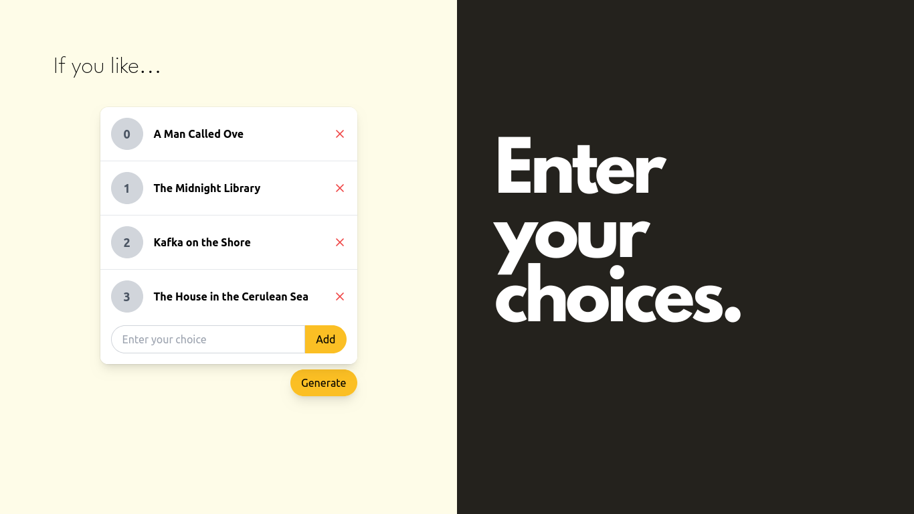
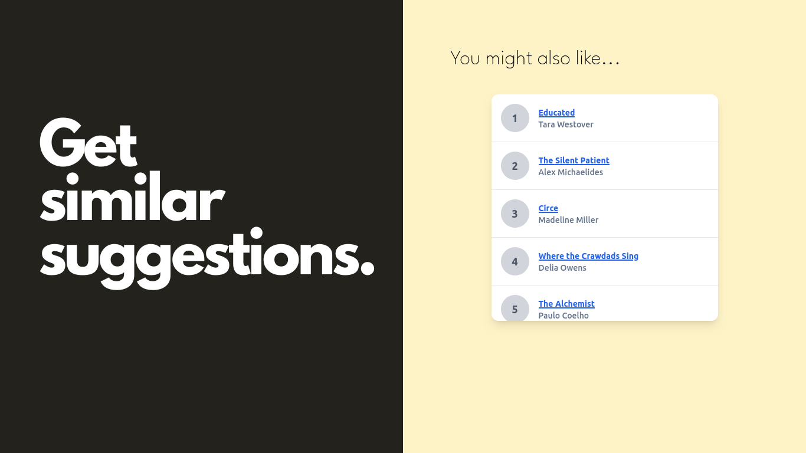

# "If You Like" - A Svelte Web App with OpenAI ChatGPT Integration

## Description 📚🎶🎬🧠

With "If You Like" users can input examples of their favorite books, music, movies, or personalities, and receive suggestions that align with their tastes. The app leverages OpenAI's ChatGPT to analyze inputs and generate relevant, context-aware recommendations.

## Features

- **Book Recommendations:** Find books that resonate with your reading preferences.
- **Music Discovery:** Explore music that matches your taste.
- **Movie Suggestions:** Get movie recommendations tailored to your liking.
- **Personality Insights:** Discover famous personalities that align with your interests.

## Screenshots 📸

## Configuration ⚙️

To get the app up and running, you need to add your own API key in the `.env` file in the root folder of the project.

## Troubleshooting 🚧

- **Delayed Responses:** If you experience any delays in getting responses, it's likely due to the OpenAI API. Please be patient as the queries are processed.

## Contributions and Feedback 🤝

Your contributions and feedback are welcome! If you have any suggestions or encounter any issues, please feel free to open an issue or submit a pull request.
